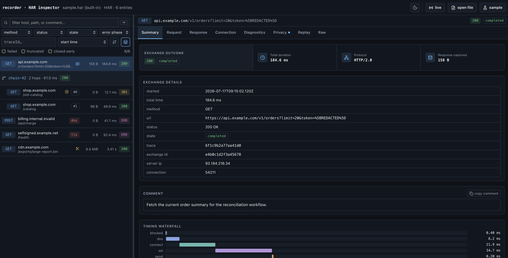

# recorder

[](https://github.com/mgurevin/recorder/actions/workflows/ci.yml)
[](https://pkg.go.dev/github.com/mgurevin/recorder)
[](LICENSE)

`recorder` is an `http.RoundTripper` that records the full life cycle of
`net/http` client exchanges as **HAR 1.2** documents. It records successful
responses and, just as thoroughly, calls that fail before or during the
response: DNS resolution, TCP connect, TLS handshake, proxy dialing, context
cancellation, and request/response body stream errors — each classified into
a structured `_error` extension.

- **Core package is standard library only.** Optional integrations (the
  OpenTelemetry adapter, the HAR inspector UI) live in separate
  modules/directories and never pull dependencies into the core.
- **Caller-visible HTTP behavior never changes.** The original request is not
  mutated, response bytes/EOF/errors pass through untouched, and recorder
  failures never break the HTTP call.
- **Redaction applies to the recording only.** The live request and response
  are never modified; secrets are replaced in the recorded copy.
- **Nothing is invented.** Values that cannot be observed (wire header sizes,
  compressed sizes after transparent gzip, unmeasured timing phases, the
  origin IP behind a proxy) are recorded as `-1` or omitted, per HAR 1.2.

## Motivation

Reliable records of outbound HTTP exchanges are essential in systems where
requests may need to be investigated, reconciled, or audited later. This is
particularly important in financial workflows, where a successful response
alone may not provide enough context to explain an operational incident or a
disputed transaction.

Most HTTP recording tools focus on completed request/response pairs. In
production, however, failures can occur at any stage of the exchange: DNS
resolution, TCP connection, proxy negotiation, TLS handshake, request
transmission, response streaming, or context cancellation. Diagnosing these
failures requires transport-level timing and error information alongside the
HTTP data.

`recorder` captures this complete client exchange lifecycle as a portable HAR
1.2 document while preserving the behavior of Go's `net/http` stack. It
records only observable data, keeps body capture opt-in, and applies
configurable redaction and sensitive-value protection to the recorded copy.
The resulting artifact is suitable for debugging, incident analysis,
reconciliation, and controlled audit workflows without turning the recorder
itself into a new source of application failures.

## Requirements

- Core module: Go 1.24 or newer.
- `otelrecorder` module: Go 1.25 or newer, matching its OpenTelemetry dependencies.

CI tests each module on its minimum supported Go version and the current
stable Go release.

## Quick start

```go
package main

import (
	"io"
	"net/http"
	"os"

	"github.com/mgurevin/recorder"
)

func main() {
	rec := recorder.NewMemoryRecorder()
	client := &http.Client{
		Transport: recorder.NewTransport(http.DefaultTransport, rec),
	}

	resp, err := client.Get("https://example.com/")
	if err == nil {
		io.Copy(io.Discard, resp.Body) // the entry finalizes on body EOF/Close
		resp.Body.Close()
	}

	rec.WriteHAR(os.Stdout) // or: har := rec.HAR()
}
```

An entry is **not** complete when `RoundTrip` returns — the response body has
not been read yet. It reaches the recorder when the body hits EOF, is closed
early, or fails; transport errors finalize immediately. A body that is never
read *and* never closed produces no entry (a caller bug that also leaks the
connection in plain `net/http`).

## What gets recorded

| Area | What is recorded |
| --- | --- |
| HAR request/response | method, URL, status, headers (wire-order when observable), cookies, body metadata |
| timings | blocked, dns, connect, ssl, send, wait, receive |
| `_error` | transport/body failure: phase, type, message, timeout/context flags, unwrap chain |
| `_network` | DNS results + coalescing, local/remote address, IP version, reuse/idle, proxy, HTTP/2, idle-pool return |
| `_tls` | TLS version, cipher suite, ALPN, SNI, resumption, OCSP/SCT, certificate chain |
| `_requestBody` / `_responseBody` | completion, early close, truncation, total/captured bytes, hash, store reference |
| trailers / transfer encoding | `_requestTrailers`, `_responseTrailers`, `_*TransferEncoding` |
| `_trace` | raw httptrace event timeline (when enabled); details pass through `RedactErrorMessage` |
| `_expect100` | `Expect: 100-continue` handshake (waited, received, wait time) |
| `_informational` | 1xx interim responses (100, 103 Early Hints) with redacted headers |
| correlation | `_traceId`, `_exchangeId`, `_redirectIndex` |

Stripping every `_`-prefixed field leaves a valid plain HAR 1.2 document
(verified by test); the files open in standard HAR viewers.

Security issues should be reported privately as described in
[SECURITY.md](SECURITY.md). Release history is maintained in
[CHANGELOG.md](CHANGELOG.md), and reproducible performance measurements and
configuration guidance are documented in [BENCHMARK.md](BENCHMARK.md).

## Default configuration

`NewTransport` starts from `DefaultOptions()` and applies your `Option`
values on top:

| Option field | Default | Notes |
| --- | --- | --- |
| `CaptureRequestBody` | `false` | lifecycle and byte counts tracked; content capture is opt-in |
| `CaptureResponseBody` | `false` | lifecycle and byte counts tracked; content capture is opt-in |
| `EmbedBodies` | `false` | body text is not embedded by default |
| `MaxRequestBodyBytes` | `1 MiB` | content capture limit; `<= 0` means unlimited |
| `MaxResponseBodyBytes` | `1 MiB` | content capture limit; `<= 0` means unlimited |
| `CaptureTLS` | `true` | `_tls` extension enabled |
| `CaptureCertificates` | `true` | peer certificate metadata enabled |
| `CaptureRawCertificates` | `false` | raw DER not embedded by default |
| `CaptureHeaders` | `true` | headers and trailers recorded |
| `CaptureCookies` | `true` | parsed cookies recorded |
| `Redaction.Common.Headers` | `Authorization`, `Proxy-Authorization`, `Cookie`, `Set-Cookie`, `X-API-Key` | case-insensitive; applies to requests and responses |
| other `Redaction` rules | empty | opt-in; `Common` applies to both directions, `Request`/`Response` add direction-specific rules |
| `HashBodies` | `false` | full-stream hashing is opt-in |
| `BodyHashAlgorithm` | `sha256` | `sha1`/`md5` supported; unknown values fall back to sha256 |
| `CaptureRawTrace` | `false` | raw httptrace event list disabled by default |
| `ContentDecoders` | `gzip`, `x-gzip`, `deflate` | stdlib decoders for record-time decoding |
| `BodyCapturePolicy` | `nil` | optional per-request/per-response decision; failures are metadata-only |
| `BodyStore` | `MemoryBodyStore` | used when nil |
| `InternalErrorMode` | `InternalErrorIgnore` | reports through `OnInternalError` if set |
| `OnInternalError` | `nil` | optional callback for recorder-internal errors |
| `Logf` | `nil` | used by `InternalErrorLog`; nil falls back to the standard log package |
| `OnEntryCompleted` | `nil` | optional per-entry callback (context + entry) |
| `RedactErrorMessage` | `nil` | optional error message redactor |

Also note:

- `WithOptions(Options{})` replaces the whole struct: zero-value options
  disable optional headers, cookies, TLS, body content, embedding, hashing and
  raw-trace capture. Core exchange fields plus body lifecycle, byte counts and
  completion state are still recorded.
- `Options` must not be mutated after the transport served its first request.

## Options reference

| Option | Effect |
| --- | --- |
| `WithOptions(o)` | Replace the entire `Options` value; apply first when combining |
| `WithCaptureRequestBody(v)` | Toggle request body content capture (size/state always tracked) |
| `WithCaptureResponseBody(v)` | Toggle response body content capture |
| `WithEmbedBodies(v)` | Off: keep sizes/hashes/store refs but embed no body text — the production setting with `FileBodyStore` |
| `WithMaxRequestBodyBytes(n)` | Request capture limit; counting continues past it |
| `WithMaxResponseBodyBytes(n)` | Response capture limit; also bounds record-time decoding |
| `WithCaptureTLS(v)` | Toggle the `_tls` extension |
| `WithCaptureCertificates(v, raw)` | Toggle certificate details; `raw` embeds Base64 DER |
| `WithCaptureHeaders(v)` | Toggle header/trailer recording |
| `WithCaptureCookies(v)` | Toggle parsed cookie recording |
| `WithRedaction(config)` | Add common and direction-specific header, query, cookie, JSON, XML, and custom body-redactor rules |
| `WithHashBodies(enabled, alg)` | Toggle body hashing / choose algorithm |
| `WithBodyStore(s)` | Storage backend for captured bytes (`MemoryBodyStore`, `FileBodyStore`, custom) |
| `WithCaptureRawTrace(v)` | Record every raw httptrace event under `_trace` |
| `WithContentDecoder(enc, dec)` | Register a record-time decoder (e.g. brotli, zstd) for a `Content-Encoding` |
| `WithBodyCapturePolicy(policy)` | Override capture, embed, hash, limit, or body redactor for each body |
| `WithInternalErrorMode(m)` | `Ignore` (default) or `Log`; recorder failures never alter the HTTP result |
| `WithOnInternalError(fn)` | Callback for recorder-internal errors |
| `WithLogf(fn)` | Logger used by `InternalErrorLog` |
| `WithOnEntryCompleted(fn)` | Per-entry completion callback — the integration hook (OTel adapter uses it) |
| `WithErrorRedactor(fn)` | Filter applied to every recorded error message |

`WithRequestRedaction(ctx, config)` and `RequestWithRedaction(req, config)` use
the same `RedactionConfig` per call and add their rules to the immutable
Transport configuration.

`RedactionConfig` has three scopes: `Common` applies to both recorded sides,
while `Request` and `Response` add rules only to that direction. Each scope is
a `RedactionRules` value containing `Headers`, `QueryParameters`, `Cookies`,
`JSONFields`, `XMLElements`, and `BodyRedactors`. Repeated configurations merge
additively; for one normalized MIME type, the most recently merged custom body
redactor wins.

## Production recipes

### Full forensic capture

Explicitly enable body capture and add the redaction your payloads need:

```go
tr := recorder.NewTransport(base, rec,
	recorder.WithCaptureRequestBody(true),
	recorder.WithCaptureResponseBody(true),
	recorder.WithEmbedBodies(true),
	recorder.WithHashBodies(true, "sha256"),
	recorder.WithRedaction(recorder.RedactionConfig{Common: recorder.RedactionRules{
		QueryParameters: []string{"token", "api_key"},
		JSONFields:      []string{"password", "secret"},
	}}),
	recorder.WithMaxResponseBodyBytes(4<<20),
)
```

### High-volume telemetry

```go
tr := recorder.NewTransport(base, rec,
	recorder.WithCaptureRequestBody(true),
	recorder.WithCaptureResponseBody(true),
	recorder.WithEmbedBodies(false),                      // no body text in the HAR
	recorder.WithBodyStore(recorder.FileBodyStore{Dir: "/var/spool/recorder"}),
	recorder.WithMaxResponseBodyBytes(64<<10),            // small capture budget
	recorder.WithHashBodies(false, ""),                   // hashing caps large streams at ~SHA-256 speed
)
```

Hashing covers every streamed byte and can become the throughput ceiling on
large bodies. See [BENCHMARK.md](BENCHMARK.md) and compare
`Benchmark100MBStreamingBody` with `Benchmark100MBStreamingBodyNoHash` on the
deployment hardware before disabling integrity metadata.

### Default header-only capture

```go
tr := recorder.NewTransport(base, rec)
```

### SOAP/XML redaction

```go
tr := recorder.NewTransport(base, rec,
	recorder.WithRedaction(recorder.RedactionConfig{Common: recorder.RedactionRules{
		XMLElements: []string{"Username", "Password"}, // covers <wsse:Password> etc.
	}}),
)
```

### Per-request export with a trace ID

```go
ctx, traceID := recorder.TraceContext(context.Background())
req, _ := http.NewRequestWithContext(ctx, http.MethodGet, url, nil)
resp, err := client.Do(req) // redirect hops share the trace ID
if err == nil {
	io.Copy(io.Discard, resp.Body)
	resp.Body.Close()
}

entries := rec.TakeTrace(traceID)   // atomically remove + return this call's entries
recorder.NewHAR(entries).Write(f)   // standalone HAR for just this call
```

### Streaming NDJSON export

`JSONStreamRecorder` writes each entry as one JSON line the moment it
completes — no buffering, and the top-level HAR wrapper is intentionally not
emitted so no JSON document is ever left half-written:

```go
stream := recorder.NewJSONStreamRecorder(w)
tr := recorder.NewTransport(base, stream)
```

### OpenTelemetry adapter

See [OpenTelemetry export](#opentelemetry-export-otelrecorder) below — the
adapter lives in the separate `otelrecorder` submodule and plugs into
`WithOnEntryCompleted`.

## Body capture, storage, and hashing

Three independent concerns:

- **Counting** always runs, even with capture off: `totalBytes` and the HAR
  size fields reflect the real stream, beyond any limit.
- **Capture** writes content to the `BodyStore` until `Max*BodyBytes` is
  reached; past the limit only counting (and hashing) continues, and the
  record is marked `truncated`. `MemoryBodyStore` (default) buffers in
  memory; `FileBodyStore` spools to temp files so large bodies never live in
  memory — **cleaning up its files is the caller's responsibility** (paths
  are exposed via `_requestBody`/`_responseBody.store`).
- The selected built-in or custom body redactor runs as a streaming transform
  before bytes reach the BodyStore. It does not write a raw body and overwrite
  it later. Each body selects one redactor, calls `Redact` once, passes each
  input byte through its returned writer once, and closes that writer once.
  Embedding reuses the already-redacted stored representation.
- **Embedding** (`EmbedBodies`) decides whether captured content becomes
  `postData.text` / `content.text` in the HAR. With `WithEmbedBodies(false)`
  the document stays small while sizes, hashes, truncation state and the
  store reference remain.

Hashes cover the **entire** stream (truncation does not affect them) and are
only emitted for complete streams — a partial-stream hash would be
misleading.

### Per-exchange capture policy

`WithBodyCapturePolicy` can override the global body options for each request
and response independently. The callback receives immutable metadata and the
decision derived from the transport's current `Options`:

```go
policy := recorder.BodyCapturePolicyFunc(func(
	ctx context.Context,
	meta recorder.BodyCaptureMeta,
	decision recorder.BodyCaptureDecision,
) (recorder.BodyCaptureDecision, error) {
	if meta.Direction == recorder.ResponseBody && meta.StatusCode >= 500 {
		decision.Capture = true
		decision.Embed = false
		decision.Hash = true
		decision.MaxBodyBytes = 256 << 10
	}

	mediaType, _, _ := mime.ParseMediaType(meta.ContentType)
	if meta.Direction == recorder.ResponseBody && meta.StatusCode >= 500 &&
		mediaType == "application/problem+json" {
		decision.RedactorOverride = problemJSONRedactor
	}

	return decision, nil
})

transport := recorder.NewTransport(base, rec,
	recorder.WithBodyCapturePolicy(policy),
)
```

The request decision runs before the HTTP call and therefore has status code
zero. The response decision runs after response headers arrive and can inspect
the status and content metadata. Decisions are frozen per physical exchange,
including redirect hops. Returning `Capture=false` also disables embedding and
a per-body redactor override. `RedactorOverride=nil` preserves the redactor
selected by the effective Transport/request-scoped `RedactionConfig`; a
non-nil override replaces it for that single body while still using the
library-owned protect/audit lifecycle. This is useful for runtime-only choices,
such as applying a specialized redactor exclusively to `5xx
application/problem+json` responses. Policy errors and panics are reported via
`OnInternalError` and fail closed to metadata-only recording without changing
the live HTTP result. Policies may be called concurrently and must return
quickly.

## Redaction

- **Headers, query parameters, cookies** are redacted by case-insensitive
  name; a cookie is also redacted when its carrier header (`Cookie` /
  `Set-Cookie`) is in the header list.
- **URL-encoded form redaction** applies the query-parameter rules while
  `application/x-www-form-urlencoded` bodies stream into the BodyStore.
  Matching values become `%5BREDACTED%5D`; duplicate fields, ordering, key
  spelling, separators, and every unmatched byte remain unchanged. The same
  redacted representation backs `postData.text` and `postData.params`.
- **Multipart form redaction** applies those rules to part names in explicit
  `multipart/form-data` bodies. Matching field/file payloads become
  `[REDACTED]`; matching files also have their `filename` metadata redacted.
  Unmatched parts and multipart framing remain byte-for-byte unchanged.
  Ambiguous headers, invalid boundaries, and unmatched nested multiparts stop
  store capture instead of falling back to raw bytes.
- **JSON field redaction** recursively replaces matching object-field values
  while preserving every unredacted byte (including whitespace, key order,
  duplicate keys, number spelling, and escapes). UTF-8 BOM input and every
  document in `application/x-ndjson` are handled.
- **XML element redaction** replaces the complete subtree inside matching elements
  (by local name, namespace prefixes ignored — `"Password"` covers
  `<wsse:Password>`), preserving the rest of the document byte-for-byte.
  XML **attribute values are not redacted**.
- Inside a matched XML subtree, mismatched or prematurely closed tags keep
  suppression active; malformed markup cannot end redaction early.
- A bounded prefix sniffer recognizes JSON/XML sent under a generic or
  incorrect content type such as `text/plain`.

### Request-scoped redaction

A shared `http.Client` can add endpoint-specific redaction rules at the call
site without rebuilding its Transport. `RedactionConfig.Common` applies to
both directions; `Request` and `Response` add direction-specific rules. Name
selectors are always added to the Transport configuration and cannot disable
production-safe defaults:

```go
req, err := http.NewRequestWithContext(ctx, http.MethodPost, endpoint, body)
if err != nil {
	return err
}

req = recorder.RequestWithRedaction(req, recorder.RedactionConfig{
	Request: recorder.RedactionRules{
		Headers:         []string{"X-Customer-Token"},
		QueryParameters: []string{"account"},
		JSONFields:      []string{"cardNumber", "cvv"},
	},
	Response: recorder.RedactionRules{
		Headers:    []string{"X-Settlement-Token"},
		JSONFields: []string{"iban", "balance"},
	},
})

resp, err := client.Do(req)
```

`WithRequestRedaction(ctx, config)` is the context-only equivalent. Both helpers
copy input slices and maps; the original request and rule values may be reused
or modified afterward. Repeated calls merge their rules. Names remain
case-insensitive and duplicate body-redactor MIME registrations use the most
recent request-scoped registration.

`BodyRedactors` is the deliberate exception to additive selector behavior: a
request-scoped registration replaces the global or built-in redactor selected
for that MIME type. Treat request-scoped redactor implementations as trusted
code and keep them concurrency-safe.

Rules follow the request context across redirects and apply to every physical
exchange in that redirect chain. A `CheckRedirect` hook can attach different
rules when a later hop needs separate treatment. The precedence order is:

```text
global RedactionConfig
  < request-scoped RedactionConfig
  < BodyCaptureDecision.RedactorOverride for that body
```

The effective request and response redactors are frozen once per exchange, so
one shared client safely handles concurrent calls with different rules. The
request context should contain selector names and redactor implementations,
never plaintext secrets or protection keys.

### Sensitive-value protection modes

Built-in rules use `[REDACTED]` by default. They can instead encrypt values for
authorized recovery or create deterministic, irreversible tokens for
correlation:

```go
keys := recorder.ProtectionKeyProviderFunc(func(mode recorder.ProtectionMode) (recorder.ProtectionKey, error) {
	switch mode {
	case recorder.ProtectionEncrypt:
		return recorder.ProtectionKey{ID: "enc-2026-07", Key: encryptionKeyFromKMS}, nil // exactly 32 bytes
	case recorder.ProtectionTokenize:
		return recorder.ProtectionKey{ID: "tok-2026-07", Key: tokenKeyFromKMS}, nil // at least 32 bytes
	default:
		return recorder.ProtectionKey{}, errors.New("unsupported protection mode")
	}
})

transport := recorder.NewTransport(base, rec,
	recorder.WithRedaction(recorder.RedactionConfig{Common: recorder.RedactionRules{
		JSONFields: []string{"password", "accountNumber"},
	}}),
	recorder.WithSensitiveValueProtection(recorder.SensitiveValueProtection{
		Mode:          recorder.ProtectionEncrypt,
		KeyProvider:   keys,
		MaxValueBytes: 64 << 10,
	}),
)
```

The modes are mutually exclusive for one transport:

- `ProtectionRedact` writes `[REDACTED]` and requires no key.
- `ProtectionEncrypt` writes `REC-ENC-v1.<key-id>.<payload>` using AES-256-GCM
  with a fresh 96-bit `crypto/rand` nonce for every value. The key ID is
  authenticated as additional data. A matched value is buffered only up to
  `MaxValueBytes` (64 KiB by default, hard-clamped to 16 MiB).
- `ProtectionTokenize` writes `REC-TOK-v1.<key-id>.<hmac>` using HMAC-SHA-256.
  It streams the value through HMAC without buffering and enables equality
  correlation for values protected by the same key. It is not encryption and
  cannot recover the original value.

If a key provider fails, a key has an invalid length, random nonce generation
fails, or an encrypted value exceeds its limit, that value becomes
`[REDACTED]`. Raw plaintext is never used as a fallback. A non-positive limit
selects the safe default; it never means unlimited.

Key-provider, key-validation, randomness, and cryptographic failures are also
reported through `OnInternalError` and `InternalErrorLog`. To prevent a broken
key service from producing one log per value, failures are aggregated to one
report per request/response direction and exchange; the report includes the
affected value count and wraps the first cause. Expected `value_too_large`
policy fallbacks remain visible in `_redaction` but are not internal errors.

Protection covers values selected by the existing header, query, cookie,
JSON, XML, URL-encoded form, and multipart rules. JSON encrypts the exact raw
JSON value (including its quotes or container syntax); XML encrypts bytes
inside the matched outer element; forms encrypt the original encoded value;
multipart encrypts the part payload and protects a matching filename
separately. All unmatched bytes retain the same byte-for-byte guarantees.

Use separate encryption and tokenization keys, obtain them from a KMS or
secret manager, and rotate them by changing the non-secret key ID and active
key material. Keep old decryption keys only as long as recorded data must be
recoverable. Do not reuse protection keys for unrelated protocols. Because
tokenization is deterministic, it reveals equality and is vulnerable to
guessing when the input domain is small; use encryption or full redaction for
low-entropy secrets.

`DecryptProtectedValue` and `VerifyProtectedToken` are provided for trusted
server-side tooling. Never place plaintext or keys in HAR metadata, logs,
URLs, command history, or persistent browser storage.

### Custom body redactors

Implement `BodyRedactor` to add a streaming transform for another media type:

```go
type BodyRedactor interface {
	Redact(dst io.Writer, contentType string, protector BodyValueProtector) (io.WriteCloser, error)
}

type BodyValueProtector interface {
	NewValue() BodyValue
}

type BodyValue interface {
	io.Writer
	Finish() string
}

transport := recorder.NewTransport(base, rec,
	recorder.WithRedaction(recorder.RedactionConfig{Common: recorder.RedactionRules{
		BodyRedactors: map[string]recorder.BodyRedactor{"text/csv": csvRedactor},
	}}),
)
```

Registration matches the normalized base MIME type exactly, ignoring case and
parameters. A custom registration overrides the built-in handler for the same
type, and the last registration wins. `Redact` may run concurrently for
different bodies; each returned writer belongs to one body and must flush but
not close `dst`. Constructor, write, close, panic, and short-write failures stop
capture, are reported through `OnInternalError`, and never alter the live HTTP
exchange. Custom redactors are trusted streaming components: keep their own
buffers bounded and fail closed when input cannot be parsed safely.

For every selected plaintext value, create one `BodyValue`, stream its bytes
through `Write`, then write the string returned by `Finish` to `dst`. Recorder
centrally applies the configured redact, encrypt, or tokenize mode, enforces the
maximum protected-value size, emits versioned tokens, handles key failures
fail-closed, and records the replacement and protection audit counts. Redaction
retains no plaintext, encryption buffers only up to the configured value limit,
and tokenization streams through HMAC. The protector and its values are scoped
to one body writer; finish each value exactly once and do not retain either
after the writer closes. See the complete
[streaming CSV example](docs/examples/csv-redactor/README.md).

### Redaction audit metadata

Entries include `_redaction` when a recorded value was changed or a body
redactor ran. It summarizes request/response URL, header, query, cookie, and
body work, plus changed error and raw-trace messages. The central protector
reports `redacted` and its replacement/protection counts whenever a built-in or
custom redactor finishes at least one value. Any successful redactor that
finishes no protected values reports `unchanged`; parser or writer failures
report `failed`.
Protection summaries additionally count `redacted`, `encrypted`, and
`tokenized` outcomes and fixed fail-closed reason codes such as
`value_too_large`. They never contain key IDs, tokens, rule names, plaintext,
or underlying error messages.

The extension deliberately excludes configured field/header/cookie names,
original values, concrete Go type names, and error text. Absence of
`_redaction` means no audit event was observed; it does not prove that an older
HAR was produced without redaction because earlier versions did not emit this
extension.

Rules that hold everywhere:

- Redaction applies **only to the recorded copy** — the live HTTP request and
  response are never modified.
- Streaming parsers cap JSON/form keys, XML tags, and multipart part headers
  at 64 KiB; JSON/XML nesting is capped at 1024 and MIME sniffing at 4 KiB.
  Limit violations stop store capture rather than falling back to unredacted
  bytes.
- Because a streaming sink cannot roll back committed output, a matched field
  stays redacted even if later input proves malformed or incomplete.
- Malformed syntax that appears before a field/element can prevent the parser
  from recognizing that later match; do not rely on body redaction as an
  input-validation mechanism.
- Body hashes are computed over the real wire/caller bytes, never over
  redacted bytes.
- Error messages can carry secrets too: `WithErrorRedactor` filters every
  recorded error string.

## Failures and error classification

HTTP 4xx/5xx are **not** transport errors — they are recorded as normal
responses. Transport and body-stream failures produce a `_error` extension:

```json
{
  "_error": {
    "phase": "dns",
    "type": "*net.DNSError",
    "message": "lookup api.example.com: no such host",
    "timeout": false,
    "temporary": false,
    "contextCanceled": false,
    "contextDeadlineExceeded": false,
    "unwrapChain": ["*url.Error", "*net.OpError", "*net.DNSError"]
  }
}
```

Phases: `request_setup`, `dns`, `connect`, `proxy`, `tls`, `write_request`,
`write_request_body`, `wait_response`, `read_response_headers`,
`read_response_body`, `redirect`, `context`, `unknown`.

Classification is type-first (`errors.Is`/`errors.As` over the unwrap
chain), with httptrace progress as fallback; string matching is a last
resort for untyped errors only. Two distinctions worth knowing:

- The `context` phase and the `contextCanceled`/`contextDeadlineExceeded`
  flags require the request's **own context** to have fired. Transport-
  internal timeouts (e.g. `ResponseHeaderTimeout`) merely match context
  errors via `errors.Is` and are attributed to the phase the exchange stood
  in (`wait_response`), with `timeout: true`.
- A response body **read error** records `_error` with phase
  `read_response_body`; a body **closed early** by the caller is not an
  error — it records state `closed_early` and `_responseBody.closedEarly`.

## Timings and observability limits

HAR `timings` are milliseconds; `-1` means "not observed / not applicable",
never zero:

- Reused connections (including HTTP/2 multiplexing) report `-1` for
  dns/connect/ssl — those phases did not happen for the exchange; `blocked`
  covers the wait for a pooled connection.
- `headersSize` is always `-1`: the exact bytes written to the wire
  (including transport-added headers, HPACK on HTTP/2) are not observable at
  the RoundTripper layer.
- With transparent gzip, `bodySize` is `-1` and `content.size` is the
  decoded size (`content._decoded: true`).
- Behind a proxy the TCP peer is the proxy: `serverIPAddress` is omitted and
  `_network`'s addresses describe the proxy connection. With a standard
  `*http.Transport`, `_network.proxy` contains the selected proxy URL after
  password and configured query-parameter redaction. A custom RoundTripper
  may expose only the dialed proxy address as a `host:port` fallback.
- A response body that is neither read nor closed never finalizes — no entry
  is produced (no finalizers by design).
- `_network.putIdle` is best-effort: the connection's return to the idle
  pool can race with entry finalization, so absence means "not observed".

## Compression and content decoding

1. **Transparent gzip** — when you don't set `Accept-Encoding`,
   `http.Transport` negotiates and decompresses gzip itself. The record
   stores decoded bytes (`_decoded: true`), `bodySize` is `-1`.
2. **Record-time decoding** — when a request or response has an explicit
   `Content-Encoding` and a decoder is registered, body redaction streams the
   decoded form into the BodyStore. Request and response hashes/counters still
   describe the encoded bytes that flowed; response `bodySize` keeps the wire
   view.

`gzip`, `x-gzip` and `deflate` (zlib-wrapped or raw, sniffed like browsers)
ship by default using only the standard library. Brotli/zstd are deliberately
not bundled so the core module remains dependency-free. A complete, pinned and
tested implementation is available in
[`docs/examples/content-decoders`](docs/examples/content-decoders/):

```go
recorder.WithContentDecoder("br", func(r io.Reader) (io.ReadCloser, error) {
	return io.NopCloser(brotli.NewReader(r)), nil // github.com/andybalholm/brotli
})

recorder.WithContentDecoder("zstd", func(r io.Reader) (io.ReadCloser, error) {
	zr, err := zstd.NewReader(r) // github.com/klauspost/compress/zstd
	if err != nil {
		return nil, err
	}
	return zr.IOReadCloser(), nil
})
```

Safety rails: decoded output larger than the resolved directional body limit
(`MaxRequestBodyBytes` or `MaxResponseBodyBytes`, unless policy overrides it)
is refused,
so a compression bomb cannot blow the capture budget. When body
redaction is active, unknown/multi-step encodings and decoder failures stop
store capture rather than falling back to raw bytes. Failures are reported
through `OnInternalError` and never affect the live request or bytes received
by the caller.

## Recorder implementations

| Recorder | Stores entries? | TraceStore? | Best for |
| --- | --- | --- | --- |
| `MemoryRecorder` | yes | yes | tests, short-lived capture, `HAR()`/`WriteHAR` |
| `HARFileRecorder` | yes, until flush | yes | complete HAR file written atomically on `Flush`/`Close` |
| `JSONStreamRecorder` | no | no | streaming NDJSON, one line per entry |
| `RecorderFunc` | caller-defined | no | custom callbacks |
| `AsyncRecorder` | bounded queue only | no | decouple finalization from a slower downstream recorder |

All built-in recorders are safe for concurrent use; entries are immutable
snapshots. Only finalized entries ever reach a recorder — in-flight
exchanges are absent from every export.

### Bounded asynchronous delivery

`AsyncRecorder` wraps any `Recorder` with one bounded FIFO queue and one worker,
preserving the order of accepted entries while moving downstream I/O away from
the exchange-finalizing goroutine:

```go
stream := recorder.NewJSONStreamRecorder(output)
async, err := recorder.NewAsyncRecorder(
	stream,
	recorder.WithAsyncQueueCapacity(1024),
)
if err != nil {
	return err
}

transport := recorder.NewTransport(http.DefaultTransport, async)

// At shutdown, stop accepting entries and wait for the queue to drain.
ctx, cancel := context.WithTimeout(context.Background(), 5*time.Second)
defer cancel()
if err := async.Close(ctx); err != nil {
	log.Printf("recorder drain incomplete: %v", err)
}
```

The default backpressure policy is `AsyncBlock`: when the queue is full,
`Record` waits for capacity instead of silently discarding evidence. Because
entries are emitted while a response body is finalized, a slow or stalled sink
can therefore increase response-body `Read`/`Close` latency and leave many
application goroutines waiting. Applications that prioritize availability and
latency over complete capture must opt into that tradeoff explicitly:

```go
async, err := recorder.NewAsyncRecorder(
	stream,
	recorder.WithAsyncQueueCapacity(1024),
	recorder.WithAsyncBackpressurePolicy(recorder.AsyncDropNewest),
)
```

`AsyncDropNewest` preserves the already accepted FIFO prefix;
`AsyncDropOldest` keeps the newest entry by removing the oldest queued (not
currently in-flight) entry. Either dropping policy can leave a trace chain
incomplete. Inspect `Stats()` and alert on drops, blocked producers, queue
depth, sink panics and sink errors. `WithAsyncErrorHandler` provides a
best-effort error callback; `WithAsyncCloseSink(true)` explicitly transfers
downstream `io.Closer` ownership to the wrapper.

`Close(ctx)` continues draining in the background if the context expires, so a
later `Close` may wait again. A currently running downstream `Record` cannot be
cancelled because the deliberately minimal `Recorder` interface has no
context-aware method. `OnEntryCompleted` runs after the entry is accepted into
the async queue, not after downstream persistence.

`AsyncBlock` prevents queue-overflow drops only during normal process
operation. `AsyncRecorder` does **not** provide crash durability, retries,
`fsync`, acknowledgement or proof of persistence. Process termination, sink
failure or failure to drain at shutdown can still lose queued evidence; use a
durable spool outside this in-memory decorator when that guarantee is required.

## Trace correlation

`http.Client` follows redirects above the transport, so each hop is a
separate entry. Correlate them through the context:

- `recorder.WithTraceID(ctx, id)` — install your correlation ID; every hop
  records it as `_traceId` with an incrementing `_redirectIndex`.
- `recorder.TraceContext(ctx)` — same, with a generated random ID.

`MemoryRecorder` and `HARFileRecorder` implement the optional `TraceStore`
capability (discovered via type assertion on `Recorder`):

- `EntriesByTrace(id)` — return the trace's entries, keep them stored
- `RemoveTrace(id)` — delete the trace's entries
- `TakeTrace(id)` — **atomically** remove and return them; an entry
  finalized concurrently can never fall between a query and a delete

`MemoryRecorder` additionally provides `HARForTrace(id)` as a convenience
helper that builds a HAR document for one trace; it is not part of the
`TraceStore` interface. For other recorders, combine
`TakeTrace`/`EntriesByTrace` with `recorder.NewHAR(entries)`.

## HAR inspector

The repo ships a local React + TypeScript viewer under
[`inspector/`](inspector/) for the HAR files this library produces,
including every `_` extension field:



[Open the live Inspector](https://mgurevin.github.io/recorder/?sample) — HAR
files selected from disk are parsed locally in your browser and are not
uploaded.

- Entry list with filtering (method, status class, state, error phase,
  host/path search, traceId, failed/truncated/closed-early), sorting, and
  trace-chain grouping by `_traceId`.
- Detail tabs: overview with a timing waterfall, timings (`-1` shown as
  "not observed"), request/response with JSON/XML pretty printing and
  binary indicators, `_error`, `_network`, `_tls` with the certificate
  chain, raw `_trace` timeline, raw JSON with unknown extensions preserved,
  and a Replay tab that reconstructs a cURL command (including `--proxy`
  from the redacted `_network.proxy` URL when present).
- Virtualized list for large HAR files; responsive down to mobile widths.

```bash
cd inspector
npm install
npm run dev     # http://localhost:5173
npm run typecheck # TypeScript 7 native compiler
npm run lint
npm run lint:fix
npm run build
npm test
```

Workflow:

```text
1. produce a HAR with recorder (WriteHAR / HARFileRecorder)
2. open the inspector
3. drag & drop the .har file (or use the file picker / built-in sample)
4. inspect entry details tab by tab
```

**Security note:** HAR files routinely contain sensitive data. The inspector
parses files **locally in your browser** — nothing is uploaded anywhere. See
[inspector/README.md](inspector/README.md).

## OpenTelemetry export (`otelrecorder`)

The [`otelrecorder`](otelrecorder/) submodule (its own Go module — the core
stays dependency-free) exports finished entries as OTel span events and
metrics through the `OnEntryCompleted` hook:

```go
import "github.com/mgurevin/recorder/otelrecorder"

exporter, err := otelrecorder.NewExporter() // uses the global OTel providers
if err != nil {
	// handle
}
tr := recorder.NewTransport(base, rec,
	recorder.WithOnEntryCompleted(exporter.OnEntryCompleted))
```

When the sink is wrapped by `AsyncRecorder`, pass that wrapper to the exporter
to observe queue health and backpressure without putting sink identity or entry
data into metric attributes:

```go
asyncRec, err := recorder.NewAsyncRecorder(rec,
	recorder.WithAsyncQueueCapacity(1024))
if err != nil {
	// handle
}

exporter, err := otelrecorder.NewExporter(
	otelrecorder.WithAsyncRecorder(asyncRec))
if err != nil {
	// handle
}
defer exporter.Close() // unregisters the observable metric callback
```

The async instruments report queue depth/capacity, in-flight work, currently
blocked producers, cumulative accepted/processed/blocked entries and block
duration, maximum block duration, drops by the fixed reasons `newest`,
`oldest`, and `closed`, plus observable sink errors and recovered sink panics.
`Exporter.Close` does not close or drain the async recorder; application
shutdown must separately call `asyncRec.Close(ctx)`.

With an active span in the request context, each exchange becomes a
`recorder.http.exchange` span event. Metrics are always recorded: total and
per-phase duration, streamed and captured body sizes, exchange failures,
closed-early/truncation and capture outcomes, protection-mode value counts,
fail-closed fallbacks, and body-redactor outcomes.

**Cardinality guidance:** the adapter never exports full URLs, paths, query
strings, header/cookie values, body content or raw HAR JSON.
`server.address` is host-only, metric labels use the status *class* (`2xx`,
`0`), correlation IDs are span-event-only and opt-in, string values are
clamped. Custom attributes are for user-controlled low-cardinality
dimensions such as a route *template* — never raw paths or IDs. When you
need the full HAR entry, write it to a dedicated sink (`HARFileRecorder`,
`JSONStreamRecorder`); an OTel attribute is the wrong place for a document.
Protection reasons, body directions, HTTP phases, and redactor outcomes are
closed bounded dimensions; rule names, key IDs, protected values and internal
error text never become metric attributes.

## Development

Go formatting and linting use `golangci-lint` v2.11.4. `gofumpt` and
`goimports` provide deterministic formatting; `wsl_v5` enforces the project's
blank-line grouping rules. Use `make format` to apply all safe Go and Inspector
fixes across the repository, `make lint` for a non-mutating style check, and
`make check` for the complete local pre-push verification. Individual targets
are available when a faster feedback loop is useful:

```bash
make format          # apply formatting and safe lint fixes
make lint            # lint both Go modules and the Inspector
make test            # non-race Go tests plus Inspector tests
make test-race       # race-enabled tests for both Go modules
make vet             # vet both Go modules
make inspector-check # Inspector tests, type-check and production build
make benchmark-smoke # compile and run every benchmark once
make check           # complete non-mutating pre-push verification
```

The Inspector uses the stable TypeScript 7 native compiler for type-checking.
ESLint consumes Microsoft's `@typescript/typescript6` compatibility API because
TypeScript 7.0 does not yet expose a stable programmatic API.

Architecture decisions, invariants and known limitations are documented in
[DESIGN.md](DESIGN.md). Benchmark methodology, current measurements, and
performance-sensitive configuration guidance are in [BENCHMARK.md](BENCHMARK.md).
